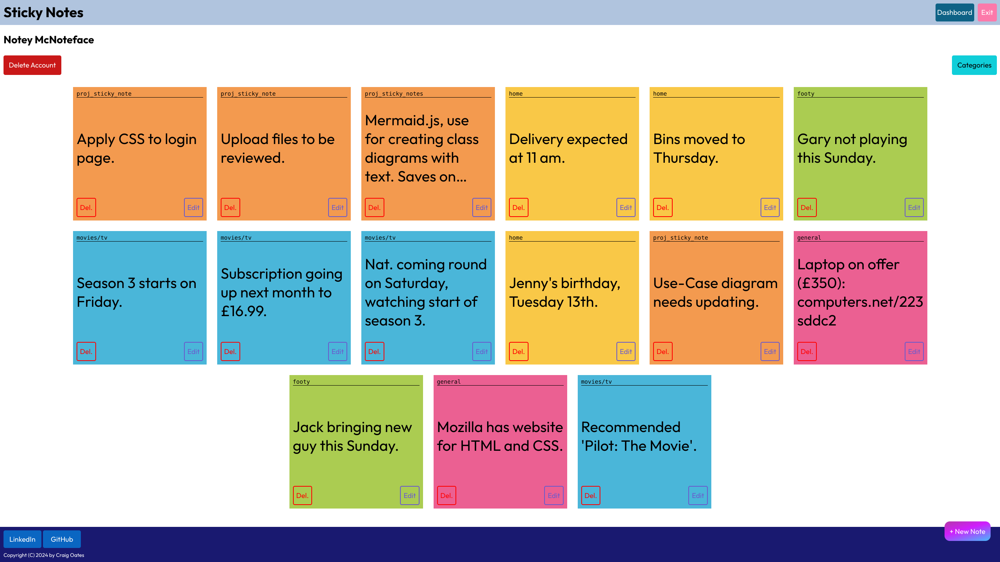
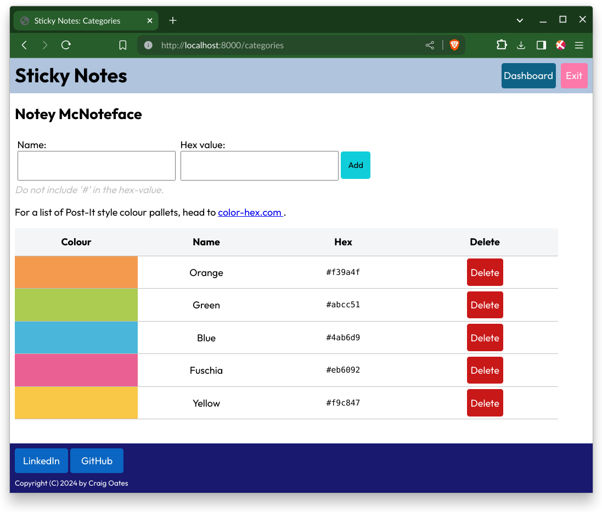

# Sticky Notes

This is Task 26 – Django – Sticky Notes Application Part 2



# Set-Up

```bash
# Assuming you are in the project’s root directory…
# And on Linux…
python -m venv venv
source venv/bin/activate
pip install -r requirements.txt
cd sticky_notes
python manage.py migrate
python manage.py createsuperuser
# Enter your details…
python manage.py runserver
```

Open [localhost:8000](http://localhost:8000) in your browser, can click on ‘Login’ on home page. Use your superuser details to log in.

# Notes

1. Only the superuser can access the Categories section.
2. Basic user will only be able to select from a pre-determined list of categories (i.e. colours), set be the superuser.
3. Whilst stated on the website, use [color-hex.com](https://www.color-hex.com/) for a list various Post-it note styles colour themes.
4. Use case, class and sequence diagrams can be found in the [/assets](./assets) directory, alongside the screenshots.

# Colour Theme Starter Pack (Category Section)

You are free to make you own colour theme, the collections below are to help to
get started, quickly.

## Rio de Janerio

- [color-hex.com](https://www.color-hex.com/color-palette/23469)

| Colour | Hex    |
| ------ | ------ |
| Orange | fbae3c |
| Pink   | eb6092 |
| Blue   | 4ab6d9 |
| Green  | abcc51 |
| Yellow | f9c847 |

## Cape Town

- [color-hex.com](https://www.color-hex.com/color-palette/23476)

| Colour    | Hex    |
| --------- | ------ |
| Red       | ff6c89 |
| Orange    | fbae3c |
| Turquoise | 3bd7c2 |
| Pink      | fd4db0 |
| Yellow    | e7f152 |


